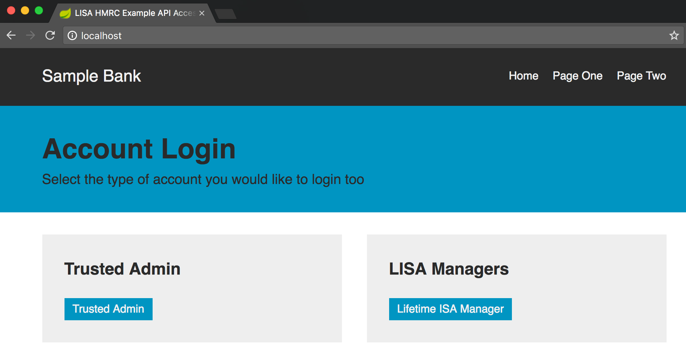
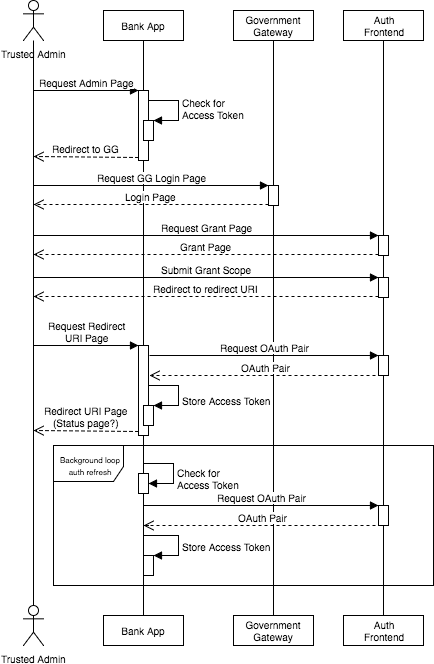
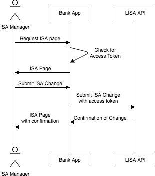

# Lifetime ISA Example Client

The LISA API has an unusual method of authenticating where a Trusted Admin will sign-in to their Government Gateway account and grant the application access to the LISA API.  The security tokens will be stored by the 3rd party banking application so that any of the LISA Managers can create lifetime events and maintain the Lifetime ISAs for their customers without having to sign-in to the Government Gateway.

## The Example Application

This code runs Sping Boot with a Apache Wicket UI framework.  It is configured to run using the HMRC External Test environment.

### HTTPS setup
The sign-in flow requires a secure https URL to redirect to after a successful (or failed) login attempt.  The Java application listens on http port 8080 by default so the easiest way to provide https is to add a reverse proxy.  It's beyond this readme to go through all the steps to configure a reverse proxy but basically you'll need to create an SSL certificate and configure routing on your chosen proxy.  

For example, on a Mac running nginx, I would generate a local certificate:

```
sudo openssl req -x509 -nodes -days 365 -newkey rsa:2048 \
-keyout /usr/local/etc/nginx/cert.key -out /usr/local/etc/nginx/cert.crt
```

and then edit the nginx configuration to add the reverse proxy:
	
	server {

	    listen 443;
	    server_name localhost;
	
	    ssl_certificate           /usr/local/etc/nginx/cert.crt;
	    ssl_certificate_key       /usr/local/etc/nginx/cert.key;
	
	    ssl on;
	    ssl_session_cache  builtin:1000  shared:SSL:10m;
	    ssl_protocols  TLSv1 TLSv1.1 TLSv1.2;
	    ssl_ciphers HIGH:!aNULL:!eNULL:!EXPORT:!CAMELLIA:!DES:!MD5:!PSK:!RC4;
	    ssl_prefer_server_ciphers on;
	
	    location / {
	
	      proxy_set_header        Host $host;
	      proxy_set_header        X-Real-IP $remote_addr;
	      proxy_set_header        X-Forwarded-For $proxy_add_x_forwarded_for;
	      proxy_set_header        X-Forwarded-Proto $scheme;
	
	      # Fix the “It appears that your reverse proxy set up is broken" error.
	      proxy_pass          http://localhost:8088;
	      proxy_read_timeout  90;
	
	      proxy_redirect      http://localhost:8088 https://localhost;
	    }
	  }
	server {
	
	    listen 80;
	    server_name localhost;
	
	    location / {
	
	      proxy_set_header        Host $host;
	      proxy_set_header        X-Real-IP $remote_addr;
	      proxy_set_header        X-Forwarded-For $proxy_add_x_forwarded_for;
	      proxy_set_header        X-Forwarded-Proto $scheme;
	
	      # Fix the “It appears that your reverse proxy set up is broken" error.
	      proxy_pass          http://localhost:8088;
	      proxy_read_timeout  90;
	
	      proxy_redirect      http://localhost:8088 http://localhost;
	    }
	  }
	    include servers/*;
	}
	
### Dev Hub create application
Before starting the Java example, you will need to sign-up for a HMRC application on the External Test environment.

If you don't already have an account, go to 

```
https://test-developer.service.hmrc.gov.uk/developer/registration
```

then add an application here

```
https://test-developer.service.hmrc.gov.uk/developer/applications
```

Once you have an application, there will be a tabs which include Details and Testing Credentials.  Add `https://localhost/admin` to the *Redirect URI* section of the Details tab.  Don't forget to click `Save Changes` at the bottom.

In the *Subscriptions* tab, subscribe to Lifetime ISA.

You will need the Client ID and Secret from the *Testing Credentials* tab for the configuration below.

### Application configuration
Clone the example code from github 

```
https://github.com/hmrc/lisa-example-client
```

### Start the application
The application is based on Spring Boot.  Assuming you have java and maven installed, you can go to the root folder of the project code and run

```
cd lisa-example-client
mvn clean spring-boot:run -Dtax.clientId=[YOUR CLIENT ID] -Dtax.secret=[YOUR SECRET]
```

Obviously, change the values for your client id and your secret.

### Create a test user

A Trusted Admin will need to sign-in and grant access to the example client for the Lifetime ISA scope.  Since we are running against the External Test environment, you have to create an Individual test user here

```
https://test-developer.service.hmrc.gov.uk/api-test-user
```
	
_This will change soon to use the `/create-test-user/individuals` service once the LISA enrolements function has been added._

### Running the client

Assuming that everything is running right, you should be able to open a web browser and go to 

```
https://localhost/
```
	
You should see the sample client home page



Sign-in as a Trusted Manager, sign-in to GG and Grant LISA scope to this application


Go back to the honepage then sign-in as a LISA Manager and manage a Lifetime ISA. As a LISA Manager, you will not need to sign-in to the Government Gateway since the system is caching the security tokens from the Trusted Manager.

In the background the system is looking to see if the security tokens need refreshing.  18 months after the Trusted Admin signed-in (or if the client is restarted) the security tokens will not automatically refresh and the Trust Admin will need to sign-in again.

## Sequence Diagrams

### Trusted Manager and Auth Flow


### ISA/Branch Manager Flow


### License

This code is open source software licensed under the [Apache 2.0 License]("http://www.apache.org/licenses/LICENSE-2.0.html").